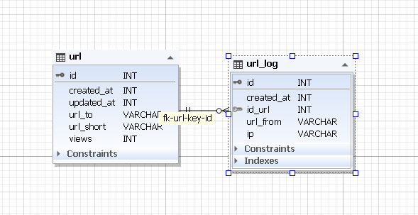

[](https://www.yiiframework.com/)

# Тестовое задание по yii2, создание QR-кода по ссылке.

## Пример кода:

```php
   public function actionGetQr()
    {
            Yii::$app->response->format = Response::FORMAT_JSON;
            $out = ['success' => false, 'response_error' => '', 'data' => ''];

            $url_to=Yii::$app->request->post('UrlModel')['url_to'];
            if(!$model=UrlModel::findOne(['url_to'=>$url_to]))
            {
                  $model = new UrlModel();
                  $model->views=0;
             }
            if ($model->load(Yii::$app->request->post()) && $model->validate()) {
                $model->views=$model->views+1;
                $model->save();

                $qrCode = (new QrCode($model->url_to))
                    ->setSize(250)
                    ->setMargin(5)
                    ->setBackgroundColor(51, 153, 255);
                $out['success'] = true;
                $out['data'] = [
                    'url'=>$model->url_to,
                    'url-image'=>'data:image/png;base64,'.base64_encode($qrCode->writeString()),
                    'short_url'=>$model->url_short,
                    'views'=>$model->views,
                    ];
            } else {
                $out['error'] = json_encode($model->errors);
            }
            return $out;
        }
```

## Структура таблиц
